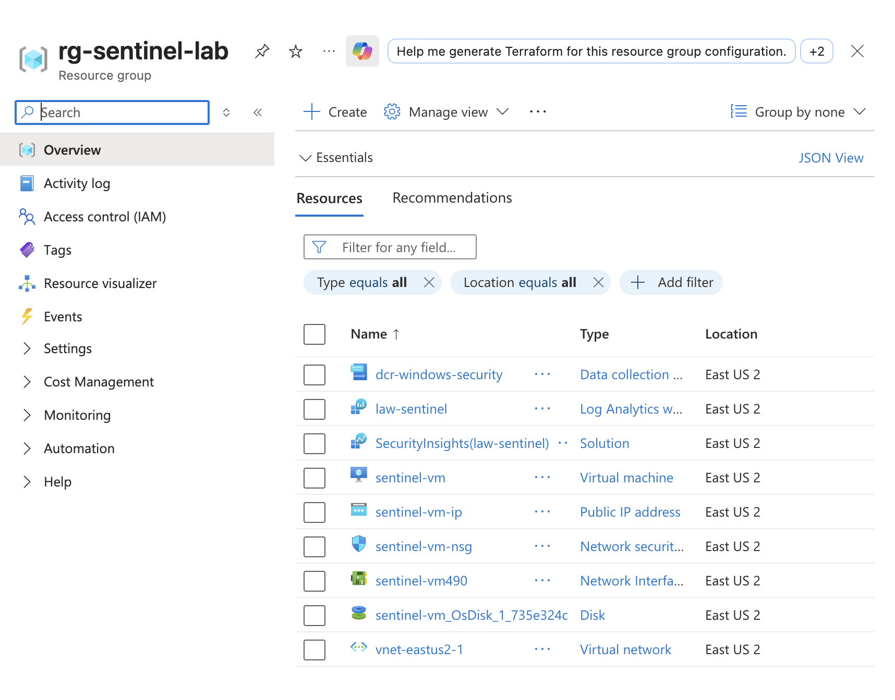
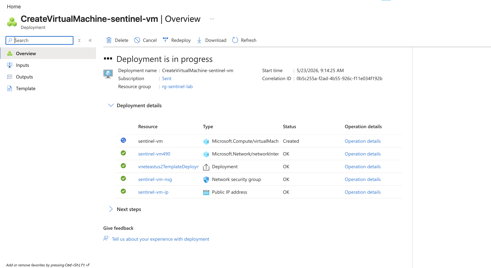
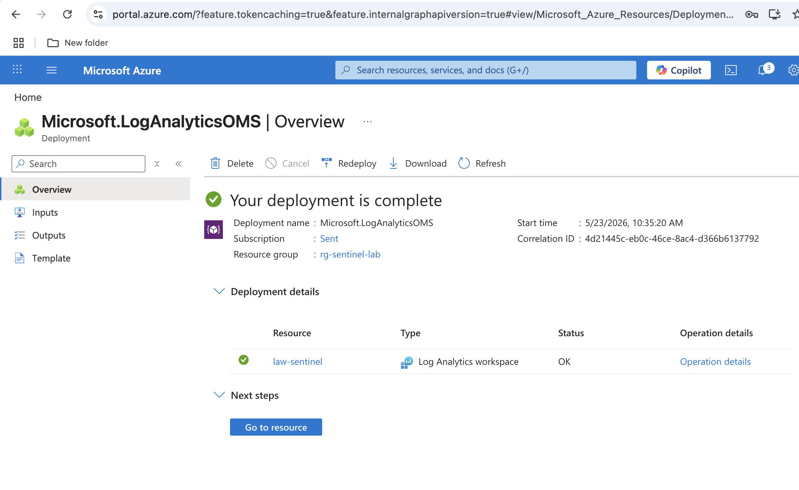
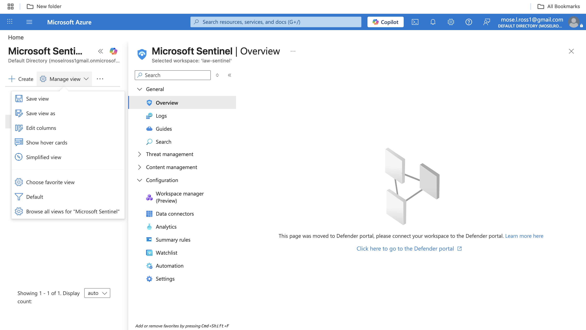
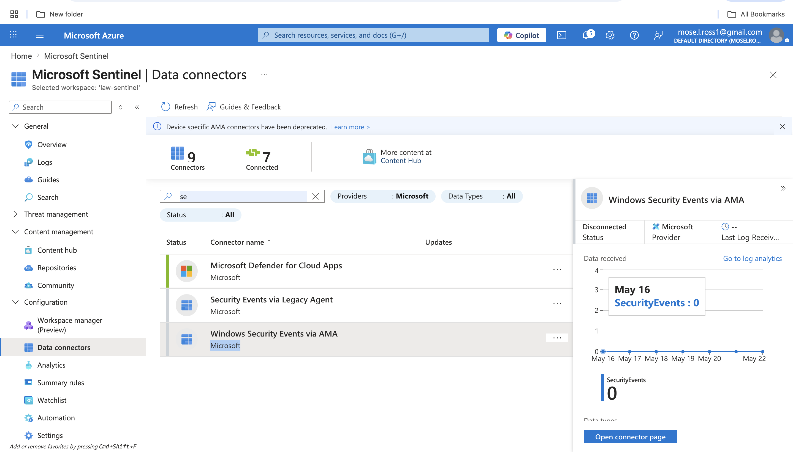
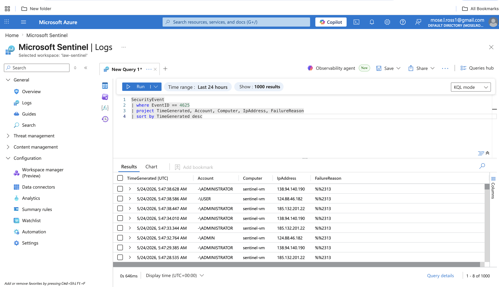

# Azure Sentinel SOC Lab – Brute Force Detection & Log Analysis

## Overview

This project demonstrates the deployment and configuration of a cloud-based Security Operations Center (SOC) lab using Microsoft Azure and Microsoft Sentinel. The lab was designed to simulate real-world security monitoring by ingesting Windows Security Event logs, analyzing authentication activity using Kusto Query Language (KQL), and creating custom detection rules for brute-force login attempts.

The project focuses on foundational SOC analyst skills including telemetry ingestion, log analysis, threat detection, incident correlation, and alert engineering.

## Objectives

- Deploy a Windows virtual machine in Microsoft Azure
- Configure Microsoft Sentinel SIEM integration
- Ingest Windows Security Event logs into Log Analytics Workspace
- Analyze authentication telemetry using KQL queries
- Detect failed login attempts and brute-force behavior
- Create custom analytics and detection rules
- Map alerts to MITRE ATT&CK techniques
- Gain hands-on experience with cloud-based SOC operations

## Architecture

Internet
   ↓
Azure Windows Virtual Machine
   ↓
Azure Monitor Agent (AMA)
   ↓
Log Analytics Workspace
   ↓
Microsoft Sentinel SIEM
   ↓
KQL Queries & Detection Rules
   ↓
Security Alerts & Incident Correlation

# Phase 1 — Azure Environment Setup

## Step 1 — Created Azure Resource Group

A dedicated resource group was created to organize all cloud resources associated with the SOC lab environment.

### Purpose
- Centralized management of resources
- Simplified deployment and cleanup
- Improved resource visibility

### Resources Included
- Windows Virtual Machine
- Log Analytics Workspace
- Microsoft Sentinel
- Networking Components
  

## Step 2 — Deployed Windows Virtual Machine

A Windows-based virtual machine was deployed in Microsoft Azure to simulate an enterprise endpoint generating security telemetry.

### Configuration
- Windows Operating System
- Public IP Address
- Remote Desktop Protocol (RDP) enabled
- Azure networking configured for inbound access

### Purpose
The VM served as the monitored endpoint for authentication events and security log generation.

# Phase 2 — Microsoft Sentinel Configuration

## Step 3 — Created Log Analytics Workspace

A Log Analytics Workspace was configured to collect, store, and analyze security telemetry generated by the Windows VM.

### Purpose
- Centralized log ingestion
- KQL query support
- Security event retention
- SIEM integration

## Step 4 — Enabled Microsoft Sentinel

Microsoft Sentinel was deployed and connected to the Log Analytics Workspace to provide SIEM functionality including threat monitoring, analytics, and incident management.

### Features Enabled
- Security monitoring
- Threat detection
- Analytics rules
- Incident correlation
- Hunting capabilities

  

 ## Step 5 — Connected Windows Security Events via AMA

The Windows Security Events connector was enabled using the Azure Monitor Agent (AMA) to ingest authentication telemetry from the Windows VM.

### Data Collected
- Successful logins
- Failed login attempts
- Account activity
- Security audit events

### Importance
This step established the telemetry pipeline required for detection engineering and log analysis.

  

# Phase 3 — Log Analysis Using KQL

## Step 6 — Queried Windows Security Events

Kusto Query Language (KQL) was used to investigate authentication activity within Microsoft Sentinel.

### Example Query

SecurityEvent
| where EventID == 4625
| summarize FailedAttempts = count() by IpAddress, Account
| order by FailedAttempts desc

  

 ## Understanding Event ID 4625

Event ID 4625 represents a failed Windows login attempt.

### Why It Matters
High volumes of Event ID 4625 activity may indicate:
- Password spraying
- Credential stuffing
- Brute-force attacks
- Unauthorized authentication attempts

Monitoring failed authentication activity is a core responsibility of SOC analysts.
